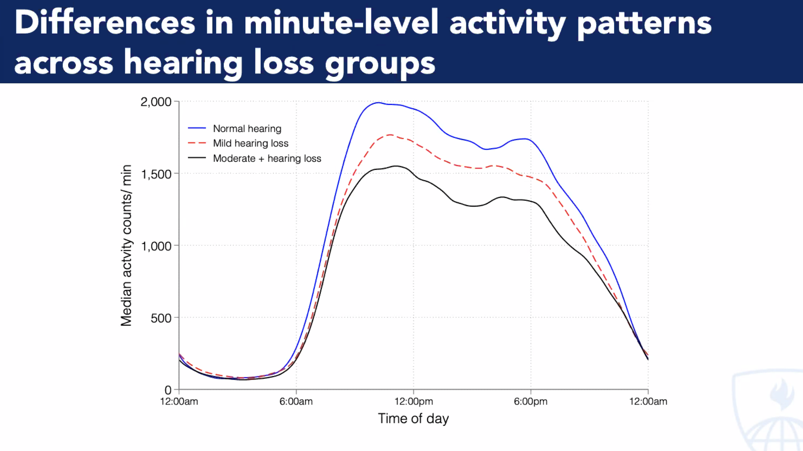
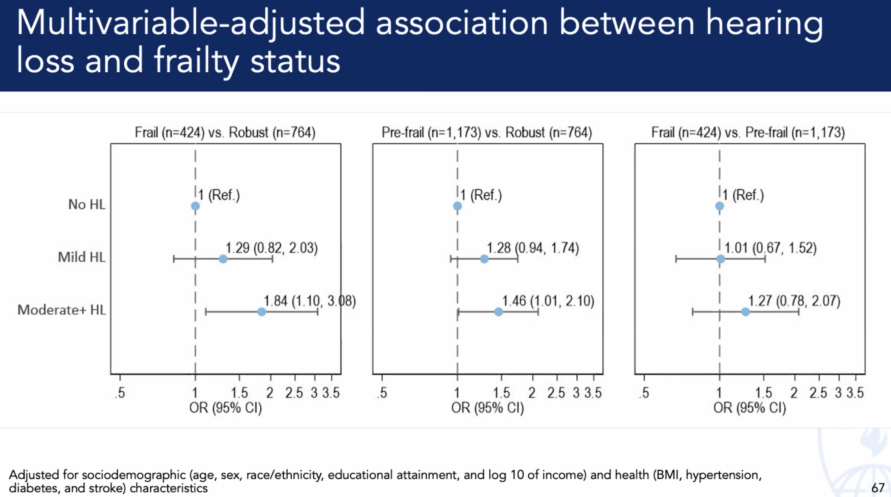

### Hearing loss, physical activity and frailty among older adults in the US
#### Pablo Martinez Amezcua, MD PhD

```
   1. Dna
         \
3. HAT -> 2. mRNA -> 5. Wide -> 6. Association
         /
         4. E-box
```

---

1. Body
   - we know about `photons -> SCN -> CLOCK`
   - how about other [sensory](https://www.mdpi.com/1422-0067/21/20/7535) inputs?
   - isn't [hearning](https://www.sciencedirect.com/science/article/pii/S2468867320301103) one such input that may disrupt sleep, increase glutamate activity, arousal...
     
3. Mind
   - cognitive
     - [hearing loss](https://www.tandfonline.com/doi/abs/10.1080/00016489.2023.2244010) risk factor for cognitive decline
     - sound-attenuated booth for quantification
     - participant wears headset:: 500-2000 Hz (normal speech)
        - $\lt 25 dB$ : no loss
        - $25-40 dB$ : mild
        - $40-60 dB$ : moderate
        - $\geq 60 dB$ : severe 
   - memory
   - arousal
     - also linked to physical decline
     - accelerometry-derived `physical activity` lower among those with hearing loss
     - hypothesis: `hearing -> social isolation/cognitive load/monitoring env -> physical activity`
     - self-reported physical activity in NHATS (Medicare beneficiaries over 65yo
     - excluded hearing-aid uses: target is untreated hearing loss
     - pure-tone audiometry
     - svy command in stata: logistic regression for self-reported; linear regression for accelerometry-derived
    


     
3. Spirit
   - joie de vivre
   - primary outcome is self-reported physical activity; but also accelerometry-based measure
   - activity: day & night over 7 consecutive days
   - most definate effect on sleep, and, thus, activity the following day
   - self-reported measures capture context

---

```
   1. CLOCK-BMAL1
                 \
   3. External -> 2. Body -> 5. Mind -> 6. Spirit
                 /
                  4. Internal
```
